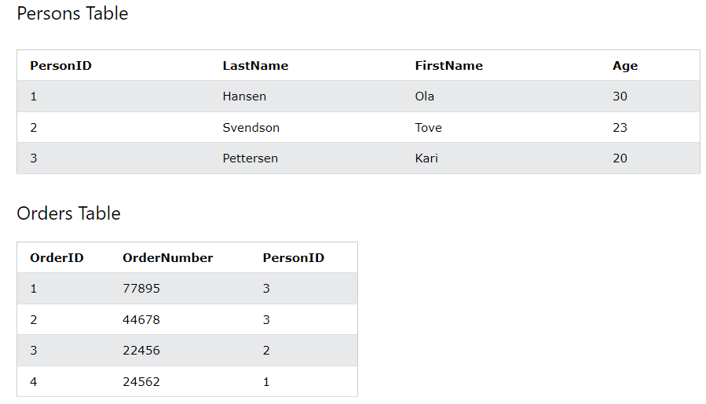

Let's say we have two tables - employees and salary.

In the "employees" table, we have the "employee_id", "first_name", "last_name", "email" and "phone_number".

In the salary table, we have the "id", "employee_id", and "salary of the employee".

Now, the "employee_id" column in the "salary" table refers to the "employee_id" column in the "employees" table. Also, the "employee_id" column is the PRIMARY KEY column of "employees" table.

The "employee_id" column in the "salary" table is called the "FOREIGN KEY.

A FOREIGN KEY is a field (or collection of fields) in one table, that refers to the PRIMARY KEY in another table. The table with the foreign key is called the child table, and the table with the primary key is called the referenced or parent table.

Notice that the "PersonID" column in the "Orders" table points to the "PersonID" column in the "Persons" table.

The "PersonID" column in the "Persons" table is the PRIMARY KEY in the "Persons" table.

The "PersonID" column in the "Orders" table is a FOREIGN KEY in the "Orders" table.

The FOREIGN KEY constraint prevents invalid data from being inserted into the foreign key column, because it has to be one of the values contained in the parent table.

# ADDING A FOREIGN KEY CONSTRAINT TO A NEW TABLE

Let's assume that we have a "customers" table which has a "customer_id" column that is the primary key of that table. There is also a "first_name" and "last_name" column.

Now, we have another table named "transactions" which has a "transaction_id" which is the primary key of this table. The table also has an "amount" column and finally a "customer_id" column. We want this "customer_id" to be linked to the "customer_id" in the "customers" table. We can do that using "FOREIGN" key constraint.

The basic syntax to add a FOREIGN KEY constraint is - 

    CREATE TABLE "table_name" (
        "column_name" "datatype",
        "column_name" "datatype",
        .....
        FOREIGN KEY ("column_name") REFERENCES "another_table_name"("column_name)
    );

For example, to create a "transactions" table where we have a "customer_id" as the FOREIGN KEY, we can do -

    CREATE TABLE transactions (
        transaction_id INT PRIMARY KEY AUTO_INCREMENT,
        amount DECIMAL(5,2),
        customer_id INT,
        FOREIGN KEY (customer_id) REFERENCES customers(customer_id)
    );

So, in the last line above, we are saying that the column "customer_id" in the "transactions" table references the "customer_id" column in the "customers" table.

It is important to note that it is not necessary that the FOREIGN KEY column should have the same name as the column in the parent table.

We could've also done - 

    CREATE TABLE transactions (
        transaction_id INT PRIMARY KEY AUTO_INCREMENT,
        amount DECIMAL(5,2),
        cust_id INT,
        FOREIGN KEY (cust_id) REFERENCES customers(customer_id)
    );

So, the names can be different but what's important is that we link the columns properly.

Generally, we try to make the names the same so that it is easier to understand what exactly is going on.

# GIVING A CUSTOM NAME TO THE FOREIGN KEY CONSTRAINT

Just like other constraints that we learned about, we can give custom names to the FOREIGN KEY constraints if we want to.

For that, the syntax is - 

    CREATE TABLE "table_name" (
            "column_name" "datatype",
            "column_name" "datatype",
            .....
            CONSTRAINT "custom_name" FOREIGN KEY ("column_name") REFERENCES "another_table_name"("column_name)
        );

For example, let's say we want to name the FOREIGN KEY constraint that we added to the "transactions" table as "fk_transactions".

So, we can do -

    CREATE TABLE transactions (
        transaction_id INT PRIMARY KEY AUTO_INCREMENT,
        amount DECIMAL(5,2),
        customer_id INT,
        CONSTRAINT fk_transactions FOREIGN KEY (customer_id) REFERENCES customers(customer_id)
    );

# DROPPING A FOREIGN KEY

An advantage of knowing the name of the foreign key constraint in a table is that we can easily drop it by this syntax - 

    ALTER TABLE "table_name"
    DROP FOREIGN KEY "name of the key"

For example, if the key is named "fk_transactions", we can do -

    ALTER TABLE transactions
    DROP FOREIGN KEY fk_transactions

# ADDING A FOREIGN KEY CONSTRAINT TO AN EXISTING TABLE

Suppose the "transactions" table is already created and so is the "customers" table. But, we haven't already added the FOREIGN KEY constraint. So, to add a FOREIGN KEY constraint to an existing table, we can use the following syntax - 

    ALTER TABLE "table_name"
    ADD FOREIGN KEY ("column_name") REFERENCES "another_table"("column_name")

For example - 

    ALTER TABLE transactions
    ADD FOREIGN KEY (customer_id) REFERENCES customers(customer_id);

If we want to also add a custom name to the key, we can use the following syntax - 

    ALTER TABLE "table_name"
    ADD CONSTRAINT "custom_name" FOREIGN KEY (customer_id) REFERENCES customers(customer_id);

For example - 

    ALTER TABLE transactions
    ADD CONSTRAINT fk_transactions FOREIGN KEY (customer_id) REFERENCES customers(customer_id)

So, the advantage now is that, we cannot insert a new row where the customer_id has some value which is not present in the "customers" table. For example, if the "customers" table has only customer_id values 1,2 and 3, we cannot add a new row in "transactions" table where customer_id is "4". 

Similarly, we cannot remove any row from the "customers" table if that customer_id is mentioned in at least one row in the "transactions" table. The only way to remove a row from "customers" table is if that row's "customer_id" is not a FOREIGN KEY in any other table. If it is, then we first have to remove that link and only then we can remove the actual row from the "customers" table.

# FOREIGN KEY COLUMNS CAN HAVE NULL AND DUPLICATE VALUES

Unlike the PRIMARY KEY constraint that enforces the "NOT NULL" constraint as well, using the "FOREIGN KEY" constraint does not mean we cannot have NULL values in that column. Moreover, there is no restriction on duplicate values as well.

This means, if we do  -

    INSERT INTO transactions (amount, customer_id)
    VALUES (1.00, NULL);

Then, this will be a valid query.