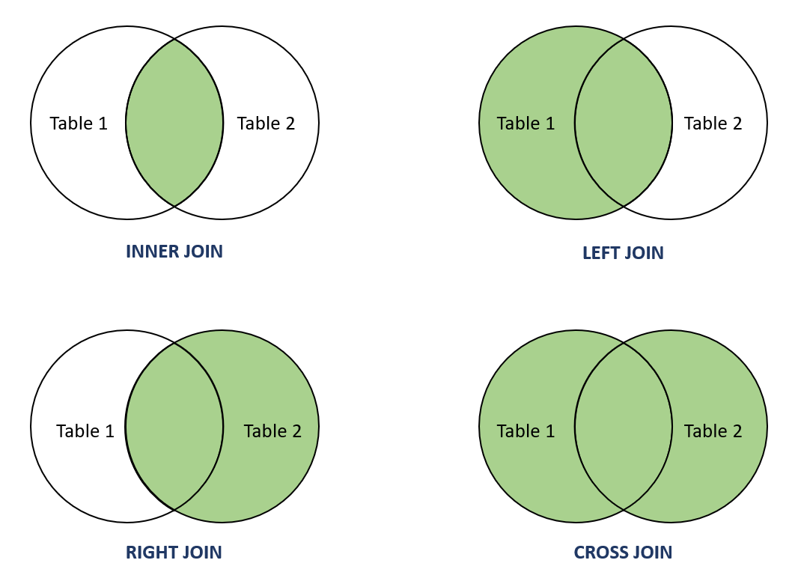
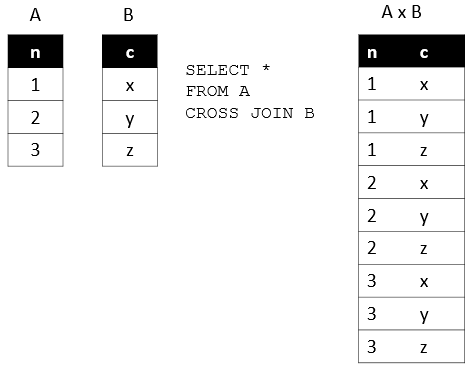

In MySQL, if we want to combine rows from two or more tables based on the fact that those two tables are linked together by some FOREIGN KEY, then we use JOINS to do that.

For example, let's say we have a "customers" table and a "transactions" table. Both the tables have a column named "customer_id". The "customer_id" is a PRIMARY KEY in the "customers" table and a FOREIGN KEY in the "transactions" table. This means, these two tables are linked together through this one column.

Now, let's say we want to list the first name, last name and also the transactions of the customers. This means, we need a combined data from two different tables. And that's where we can use JOINS.

# TYPES OF JOINS IN MYSQL

In MySQL, there are four different types of JOINS that we can use based on our requirement.

These are - 

    1. INNER JOIN - Returns records that have matching values in both tables.
    2. LEFT JOIN - Returns all the records from left table and all the matching records from the right table.
    3. RIGHT JOIN - Returns all the records from the right table and all the matching records from the left table.
    4. CROSS JOIN - Returns all the records from both the tables.

A good way to understand JOINS is using the Venn Diagrams, as shown in the image above.

# INNER JOIN IN MYSQL

Suppose we have two tables "transactions" and "customers" and the "customer_id" is a FOREIGN KEY in the "transactions" table that references the "customer_id" column of the "customers" table.

So, the two tables have a common column. 

Now, we want to display the data of all the customers that have made a transaction. And we can do that by joining the two tables based on the "customer_id" column.

And since we only want the data of customers that have made a transaction, this means we need an "INNER JOIN" here. Because we only want records with matching customer_id values in both the tables.

So, the syntax for an INNER JOIN is - 

    SELECT * FROM "left_table"
    INNER JOIN "right_table"
    ON "left_table"."column_name" = "right_table"."column_name"

For example, if we have "transactions" and "customers" tables, we can do -

    SELECT * FROM transactions
    INNER JOIN customers
    ON transactions.customer_id = customers.customer_id

Now, this will display the data of all the customers for which the customer_id is present in both the tables. 

This means, if we have any record in the "transactions" table where customer_id is NULL, that will not show up in the result of the above query. Similarly, if we have any record in the "customers" table for which there is no transaction in the "transactions" table, that will not be shown in the result.

This is how the INNER JOIN works.

One thing to note is that it is not mandatory to display all the columns when using the JOINS. We can choose what all columns to fetch in the result.

For example, if we only want the "first_name", "last_name" and the "amount", then we can do -

    SELECT first_name, last_name, amount FROM transactions
    INNER JOIN customers
    ON transactions.customer_id = customers.customer_id

One important thing is that if there are columns with same names in the two tables that we are joining, then we need to explicitly mention which table's column we want in the result.

For example, if we also want "customer_id" to be shown in the result, we cannot simply do -
    
    SELECT customer_id, first_name, last_name, amount FROM transactions
    INNER JOIN customers
    ON transactions.customer_id = customers.customer_id

MySQL will show an error when we execute the above query saying that hte "customer_id" column name is ambiguous. So, we have to explicitly tell MySQL which table's customer_id column we are referring to. Here, we can refer to either "customers" table or "transactions" table. Doesn't matter.

    SELECT transactions.customer_id, first_name, last_name, amount FROM transactions
    INNER JOIN customers
    ON transactions.customer_id = customers.customer_id

# LEFT JOIN IN MYSQL

A LEFT JOIN differs from the INNER JOIN in just one thing. Apart from the matching records, the LEFT JOIN will also return all the other records of the left table, whether they match or not.

The syntax is - 

    SELECT * FROM "left_table"
    LEFT JOIN "right_table"
    ON "left_table"."column_name" = "right_table"."column_name"

For example, if our transactions table contains some records where the customer_id is NULL, and we apply the following query - 

    SELECT * FROM transactions
    LEFT JOIN customers
    ON transactions.customer_id = customers.customer_id

The above query will also have those records which do not have any corresponding customer_id value in the transactions table. That's because "transactions" table is on the "LEFT" side and hence, the "LEFT JOIN" will take all the records of this table in the result.

# RIGHT JOIN IN MYSQL

A RIGHT JOIN is the opposite of the LEFT JOIN. A RIGHT JOIN will take all the records from the right table, even if there are some records that do not match based on the common column.

For example, if we have some customers in the 'customers' table which have not made any transactions, then their customer_id will not be present in the "transactions" table. But still, if we want to fetch their details, we can use a RIGHT JOIN. 

The syntax is - 

    SELECT * FROM "left_table"
    RIGHT JOIN "right_table"
    ON "left_table"."column_name" = "right_table"."column_name"

For example - 

    SELECT * FROM transactions
    RIGHT JOIN customers
    ON transactions.customer_id = customers.customer_id

# CROSS JOIN IN MYSQL

A CROSS JOIN is pretty different from other JOINS in the sense that it produces a Cartesian product of two or more tables.

In Math, a Cartesian product is a mathematical operation that returns a product set of multiple sets.

For example, with two sets A {x,y,z} and B {1,2,3}, the Cartesian product of A x B is the set of all ordered pairs (x,1), (x,2), (x,3), (y,1) (y,2), (y,3), (z,1), (z,2), (z,3).

Similarly, in SQL, a Cartesian product of two tables A and B is a result set in which each row in the first table (A) is paired with each row in the second table (B). Suppose the A table has n rows and the B table has m rows, the result of the cross join of the A and B tables have n x m rows.

This is the syntax of the CROSS JOIN -

    SELECT * FROM "left_table"
    CROSS JOIN "right_table";

Note that we do not write the "ON" statement in case of the "CROSS JOIN".

The CROSS JOIN can result in a very large result set and so it is not used very commonly.

