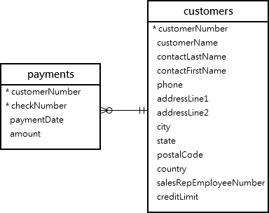
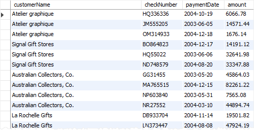

In MySQL, whenever we execute a SELECT statement, we get a table as a result. This is called the "Result Set" of the SELECT statement. 

A VIEW in MySQL is simply a "Virtual Table" that is based on the result-set of the SELECT statement. "Virtual Table" means that this is not an actual table stored in the database.

So, what is the advantage of creating a View?

For that, consider one example.

Suppose we have two tables, payments and customers and we write the following query to display some data from the two tables - 

    SELECT 
        customerName, 
        checkNumber, 
        paymentDate, 
        amount
    FROM
        customers
    INNER JOIN
        payments ON customers.customerNumber = payments.customerNumber;

Let's say that output of the above query is - 

Now, the next time we want the same data, we will need to again write the same query. One way to avoid having to write the query again is to save it somewhere, for example, in a .txt file or in a .sql file.

But, an even better way is to save this query in the database server and then assign a name to it. This named query is called a "VIEW".

So, we can say that a VIEW is simply a named query stored in the database.

# HOW TO CREATE A VIEW

To create a view, we can use the following syntax - 

    CREATE VIEW "view_name"
    AS
    "SELECT statement"

For example, if from the employees table, we require the first_name and last_name for attendance records, instead of having to write the SELECT statement again and again, we can instead create a view for it.

    CREATE VIEW employee_attendance
    AS
    SELECT first_name, last_name FROM employees

And now, we can interact with this VIEW as if it was an actual table. For example, to see all the records, we do -

    SELECT * FROM employee_attendance;

Similarly, to drop a view, we will write -

    DROP VIEW employee_attendance;

# WHAT IS THE ADVANTAGE OF CREATING A VIEW INSTEAD OF AN ACTUAL TABLE?

In SQL, we try to reduce the data duplication as much as possible. So, if we create an actual table, then that table will have duplicate data. And the issue is that when we update data in one table, we would manually require to update it in that other table as well.

But, if we have a VIEW instead of an actual table, that VIEW is always up to date with the tables on which it depends. And since it is not an actual table stored in the database, this means we do not have to worry about manually updating the records if data in some tables change.