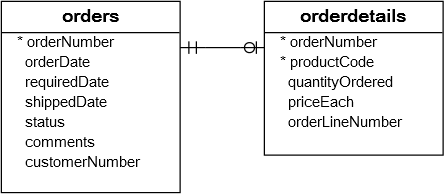

When we have to aggregage the rows by some specific column in the result-set, we use the "GROUP BY" clause. For each group, the result set has a single row. The GROUP BY statement is often used with aggregate functions (COUNT(), MAX(), MIN(), SUM(), AVG()) to group the result-set by one or more columns.

The syntax of the GROUP BY clause is - 

    SELECT column_name(s)
    FROM table_name
    WHERE condition
    GROUP BY column_name(s)
    ORDER BY column_name(s);

To understand the GROUP BY clause, let's take an example of a "transactions" table. The table has an "amount" column and an "order_date" column. And we want to know the total amount that was made each day through different transactions. For example, if there are two transactions on one day of 1.50 and 2.90 dollars, then it means that we made 4.5 dollars that day.

Without GROUP BY, we might try to write something like -

    SELECT SUM(amount), order_date 
    FROM transactions

But, this query will fail. MySQL will say that there are "aggregated" and "non-aggregated" columns in the result-set. That's why, a GROUP BY clause is required here.

A GROUP BY is only required when you have non-aggregated columns as well. If we just had - 

    SELECT SUM(amount)
    FROM transactions

OR even this - 

    SELECT SUM(amount),AVG(amount)
    FROM transactions

The above queries will work without any issues because because these are examples of aggregate queries without any grouping specified. In such cases, the aggregate function operates on the entire result set, treating it as a single group.

But, the moment we add a non-aggregated column here, the whole query will fail because it now required a GROUP BY clause.

And that's the whole idea of a "GROUP BY" clause.

It is also important to note that GROUP BY can be used without having aggregated functions. It is just that most of the time, we use it when we are dealing with aggregated and non-aggregated columns in the same result set.

So, coming back to the example of transaction amounts per day, we can do -

    SELECT SUM(amount), order_date 
    FROM transactions
    GROUP BY order_date

And now, the result-set will have more than one rows, where each row has the sum of amount column for one particular day, since we are GROUPING the rows by the 'order_date' column. So, each row in the result-set denotes a group.

# THE "HAVING" CLAUSE

Sometimes, from the result-set of the GROUP BY clause, we need to get only specific data. For example, in our "transactions" columns, we have an "amount" field and a "customer_id" field. And we want to know how many transactions each customer has made. So, in that case, we will write -

    SELECT customer_id, COUNT(amount)
    FROM transactions
    GROUP BY customer_id

Now, let's add one condition that we only want to get the data about those customers that have made more than one transaction. So, the very first thing that comes to mind is to maybe use a "WHERE" clause like - 

    SELECT customer_id, COUNT(amount)
    FROM transactions
    GROUP BY customer_id
    WHERE COUNT(amount) > 1

But, the above query will not work because "WHERE" is not a valid clause to be used after GROUP BY. 

Instead, there is another clause that we can use - HAVING. The "HAVING" clause is like the "WHERE" clause but for the "GROUP BY".

So, we can rewrite the above query as - 

    SELECT customer_id, COUNT(amount)
    FROM transactions
    GROUP BY customer_id
    HAVING COUNT(amount) > 1

And now, the above query will work.

# GROUP BY WITH MULTIPLE COLUMNS

Suppose we have a table "orders" and another table "orderdetails". Both tables have a common column named "orderNumber";

The following query returns the year, order status, and the total order for each combination of year and order status by grouping rows into groups:

    SELECT 
        YEAR(orderDate) AS year, 
        status, 
        SUM(quantityOrdered * priceEach) AS total 
    FROM orders 
    INNER JOIN orderdetails ON orders.orderNumber = orderdetails.orderNumber
    GROUP BY year, status 
    ORDER BY year;

Now here, you will see that in the GROUP BY clause, we are grouping by multiple columns. That's because if you see the "SELECT" statement, there are three columns, out of which only one is the aggregated column (total). The other two are non-aggregated and so, both needs to be mentioned in the GROUP BY clause.

So, the summary is -> Use the GROUP BY clause to group rows into subgroups.

