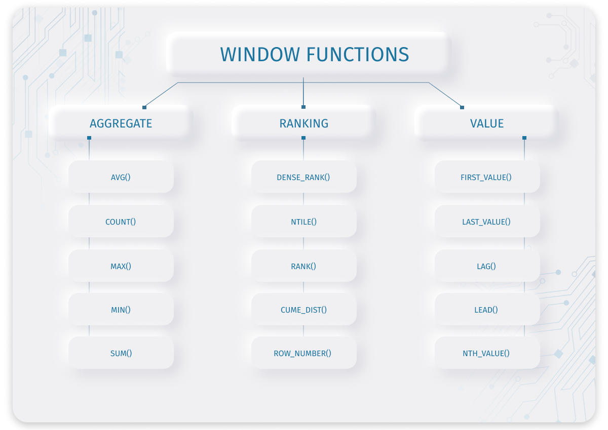

A Window Function in SQL can perform a calculation across a set of table rows that are somehow related to the current row.

This is the basic syntax for a window function in SQL - 

    window_function_name(expression)   
    OVER (  
        [partition_defintion]  
        [order_definition]  
        [frame_definition]  
    )  

We know that we have "AGGREGATE" Functions in SQL such as AVG(), COUNT(), MAX(), MIN() and SUM(). All these are also types of "WINDOW" Functions because they all perform calculation across a set of table rows. When we just use Aggregate functions alone without any special syntax, then those will perform operations on an entire table and then group the result into one row.

But, the Window Functions perform operations on a set of rows, and "PRODUCE AN AGGREGATED VALUE FOR EACH ROW". 

So far, we have been doing something like - 

    SELECT 
        SUM(col_name) 
    FROM table_name

But, when we start using Window Function syntax, we do something like - 

    SELECT
        SUM(col_name) OVER (PARTITION BY col_name)
    FROM table_name

There are two main types of Window Functions in SQL - 

    - Aggregate Window Functions : These include SUM, COUNT, AVG, MIN, MAX etc. They typically return a scalar value.

    - Analytical Window Functions : These can further be divided into "RANKING" and "VALUE" functions. They establish a window of records depending on the current row and then compute the results using that window. The output is typically given as a set of records. For example, RANK, DENSE_RANK, ROW_NUMBER, CUME_DIST, LAG, LEAD etc.

Let's say that we have an "Employee" table. And this table has four columns - 

    1. emp_id
    2. emp_name
    3. dept_name
    4. salary

Pretty simple.

Now, what if we want to find what is the "Maximum" salary among all the employees? Well, that's very easy. We can just write - 

    SELECT 
        MAX(salary)
    FROM Employee

Or, what if we want to find the maximum salary in each department? Again, that is very easy. We can do -

    SELECT 
        dept_name,
        MAX(salary)
    FROM Employee
    GROUP BY dept_name

Now, what if, along with the data about the maximum salary in each department, we also want to display other data from the employee table such as the names of the employees, their ids etc. 

In other words, we want to have a result table that has emp_id, emp_name, dept_name, salary, and the maximum salary in that department.

If you think about it, this type of result set is not achievable with a simple SELECT statement. We might have to use other things like JOINS or Subqueries to get it. And on top of all this, there will be an impact on the performance as well.

And this is a sort of use case where we can use WINDOW FUNCTIONS. 

Why?

Because remember that the Window Functions perform operations on a set of rows, and "PRODUCE AN AGGREGATED VALUE FOR EACH ROW".

And that's what we need for our use case. We want an aggregated value for each individual row in the result set. This aggregated value is simply the maximum salary in each department.

First, let's take a simpler use case. Let's say that we want to display the Maximum Salary column in the result set which is the maximum salary among all employees, no matter what department. 

Usually, without Window Functions, we have to use Subqueries for this. For example - 

    SELECT 
        *,
        (SELECT MAX(salary) FROM Employee) AS max_salary
    FROM Employee

But, we can use Window Functions to do the same thing. If we write a Window Function without specifying anything inside OVER(), then it will take the whole table as one WINDOW.

So, we can say -

    SELECT 
        *,
        MAX(salary) OVER() AS max_salary
    FROM Employee

Now, let's add in a slightly more complex use case. Now, we want that each row should have the max_salary value depending on the dept_name of that row. In other words, if a row has dept_name as "IT", then the max_salary column for that row should have the maximum salary for "IT" department only.

Without Window Functions, we can use a Self Join and Subquery for this. Something like this - 

    SELECT 
        A.*,
        B.max_dept_salary
    FROM Employee AS A
    JOIN (
        SELECT dept_name, MAX(salary) AS max_dept_salary
        FROM Employee
        GROUP BY dept_name
    ) AS B
    ON A.dept_name = B.dept_name

But, this can be made a lot simpler by using window functions. All we have to write is - 

    SELECT 
        *,
        MAX(salary) OVER(PARTITION BY dept_name) AS max_dept_salary
    FROM Employee

So, we went from a complicated Query that involves a Self Join, GROUP BY clause, and a Subquery, to a three line query that involves a Window Function.

Here, since we have written "PARTITION BY dept_name", this means that this MAX(salary) function will consider the rows with the same "dept_name" as one WINDOW and then calculate the maximum out of that WINDOW and display that maximum value for all those rows.

And in this way, the result set will have an extra column named "max_dept_salary" which will have the maximum salary in each row, depending on the dept_name of that row.