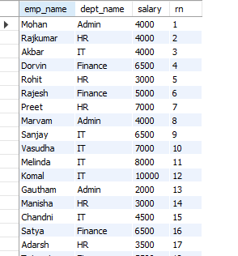
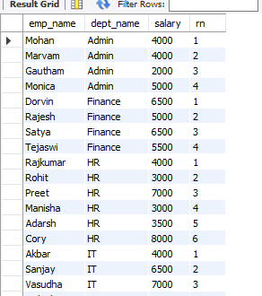
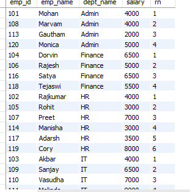
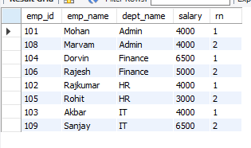

The "ROW_NUMBER" Window Function assigns a unique id to each row in the result-set.

For example, we have an Employee table with "emp_id", "emp_name", "dept_name", "salary" columns.

When we show the records from this table by running any query, we also want a column that has a uniue serial number for each row.

For example first row has "1", then second row as "2" and so on..

For this, we can use the "ROW_NUMBER" function.

It is important to note that unlike the AGGREGATE Window functions like AVG, SUM, COUNT, MIN, or MAX, which we can write without using "OVER" clause, the same cannot be done with the NON-AGGREGATE Window Functions.

So, we cannot do -

    SELECT 
        ROW_NUMBER(),
        emp_name,
        salary
    FROM Employee

This will result in an error.

Instead, we have to at least write the OVER() clause, doesn't matter if we don't have anything inside it.

    SELECT 
        emp_name,
        dept_name,
        salary,
        ROW_NUMBER() OVER() AS rn
    FROM Employee

This will display a result set like this -

Now, we know that OVER() can accept some arguments. And that's true for every Window Function that we write with OVER().

When we write just OVER(), it means MySQL will consider the whole table as one window.

But, what if we write - 

    SELECT 
        emp_name,
        dept_name,
        salary,
        ROW_NUMBER() OVER(PARTITION BY dept_name) AS rn
    FROM Employee

This will display a result-set like this -

Here "PARTITION BY dept_name" means that SQL will consider all the rows having the same value for the "dept_name" column as one window and then assign the same ROW_NUMBER value for them.

Also, "PARTITION BY" is not the only thing we can add inside OVER() clause. In fact, we can also add "ORDER BY" inside OVER().

For example, we want to display the serial numbers for all the employees of each department such that the employees are ordered by their emp_id from lowest to highest in each department. Then, we can say -

    SELECT 
        emp_name,
        dept_name,
        salary,
        ROW_NUMBER() OVER(PARTITION BY dept_name ORDER BY emp_id) AS rn
    FROM Employee

And this will display a result-set like this - 

While the ROW_NUMBER() does not seem like that useful of a function so far, let's take one more use case that will show how useful it actually is.

What if, we are asked to list out the two employees in each department who were the first to join their respective departments?
Let's say that we assign emp_id values in first come first serve manner. This means, an empployee with a lower emp_id value joined before the one having a higher emp_id value.

Now, we can make use of the ROW NUMBER that each row has. Because we have assigned a ROW NUMBER to each row, depending on the department, from this result-set, we can filter out only those rows that have a row number < 3. That is, only the top two rows in each department.

So, our query becomes - 

    SELECT 
        *
    FROM (
        SELECT 
            emp_id,
            emp_name,
            dept_name,
            salary,
            ROW_NUMBER() OVER(PARTITION BY dept_name ORDER BY emp_id) AS rn
        FROM Employee
    ) AS A
    WHERE rn < 3

This will display a result-set like this - 

So as we can see, the ROW_NUMBER() is very helpful here for such a complex use case. Without it, it will require some complicated query to get the same result.
