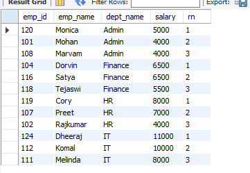
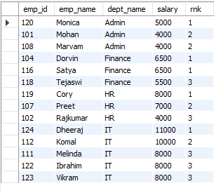
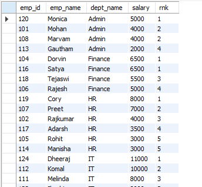

The RANK() function assigns a rank to each row within the partition of a result-set. The rank of a row is specified by one plus the number of ranks that come before it.

Suppose we have an Employee table with emp_id, emp_name, dept_name and salary columns.

We are asked to Fetch the top 3 employees in each department that are earning the maximum salary.

Now, if you think about it, we can do this using ROW_NUMBER() as well. All we have to write is - 

    SELECT 
        *
    FROM (
        SELECT 
            emp_id,
            emp_name,
            dept_name,
            salary,
            ROW_NUMBER() OVER(PARTITION BY dept_name ORDER BY salary DESC) AS rn
        FROM Employee
    ) AS A
    WHERE rn < 4

And this will give us a result-set that looks like this - 

And that's exactly what we are asked for!

But, the same can be done with "RANK" function as well. We can write - 

    SELECT 
        *
    FROM (
        SELECT 
        *,
        RANK() OVER(PARTITION BY dept_name ORDER BY salary DESC) AS rnk
    FROM Employee
    ) AS E
    WHERE rnk < 4

This will give us a result-set that looks like - 

If you compare the result-sets of the ROW_NUMBER() and RANK() functions, you will see one difference. There is a difference in the number that these functions assign to each row.

In case of ROW_NUMBER(), for each department, we have three rows and they have values as 1,2 and 3 for their rank column.

But, in case of RANK(), we can see that in a department, if there are employees with same salaries, then they have the same RANK. This is more relatable to real-world rankings.

So, that's the main difference between ROW_NUMBER() and RANK().

# IMPORTANT THING TO NOTE WHEN USING RANK()

Let's write the following query -

    SELECT 
        *,
        RANK() OVER(PARTITION BY dept_name ORDER BY salary DESC) AS rnk
    FROM Employee

It gives a result-set as - 

You will see that for "Admin" department, we have four employees and their ranks are "1", "2", "2", and "4".

Ideally, since we have two employees with same salary and hence the same rank (2), the fourth employee should have the rank as "3".

But that's not how RANK() function works.

The RANK function does not return consecutive values in the case of having multiple occurrences of the same value. Ties are assigned the same rank, with the next ranking(s) skipped. So, if you have 2 items at rank 2, the next rank listed would be ranked 4.
