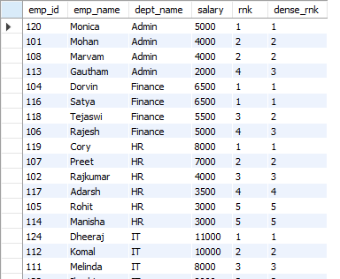

The DENSE_RANK() function is exactly the same as RANK() but with one big difference.

As we know, in RANK() function, the ties are assigned the same rank, with the next ranking(s) skipped. So, if you have 3 items at rank 2, the next rank listed would be ranked 5.

But, if we do not want the ranks to get skipped in case of ties, then we can use DENSE_RANK().

A good way to understand this is to compare the result-sets of RANK() and DENSE_RANK() side-by-side.

Let's say we have the following query using the RANK() function -

    SELECT 
        *,
        RANK() OVER(PARTITION BY dept_name ORDER BY salary DESC) AS rnk,
        DENSE_RANK() OVER(PARTITION BY dept_name ORDER BY salary DESC) AS dense_rnk
    FROM Employee

We get a result-set as - 

Notice how in the "rnk" column (which uses RANK() function), the ranks are skipped for the next employee if there are employees with same salaries before that employee.

But in the "dense_rnk" column (which uses DENSE_RANK() function), you can see that even if two employees have same salary and same rank, the next rank is not skipped for the next employee.

So, the difference between RANK() and DENSE_RANK() is that ranks are skipped in case of RANK() function if there are ties, but there is no skipping in case of DENSE_RANK().