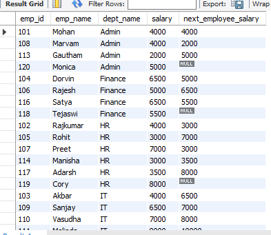
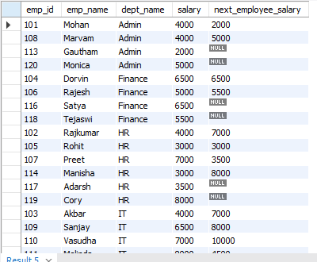

The LEAD() function is used to access the data from the "next row" in a result-set.

The basic syntax of a LEAD() function is - 

    LEAD(expression, offset, default_value) 
    OVER (
        PARTITION BY partition_expression 
        ORDER BY sort_expression
    )

Here, we can see that LEAD() accepts not just an expression but also some other things.

The "expression" is simply the column or the expression from which you want to retrieve the next value.

The "offset" is used to specify the number of rows to look ahead. By default, this value is "1" which means by default, LEAD() function always lets you access the data from the next row.

The "default_value" is used to give a default value in case there is no next row at all. For example, if you use "LEAD()" on the last row of the result-set or a partition, then by default, it will give NULL as the value. But, if we want, we can specify some other value to be returned in that case.

Let's understand the usage using an example.

Let's say that for each employee, we are asked to display the salary of the employee that joined the company after him/her in each department. 

So, in this case, we need the data about the next row and so, we can use the LEAD() function. So, we can write - 

    SELECT 
        *,
        LEAD(salary) OVER(PARTITION BY dept_name ORDER BY emp_id) AS prev_employee_salary
    FROM Employee

Here, LEAD(salary) means that from the next row, retrieve the value in the "salary" column.

Since we are using "PARTITION BY dept_name", all the employees that belong to the same department will be considered one window and the LEAD(salary) will be applied on that window. 

Finally, we are saying "ORDER BY emp_id" because this will ensure that the employees are ordered by their joining time. That is, the employees with a lower emp_id value joined before the employees with a higher emp_id value.

The above query will give the following result - 

One thing worth noticing is that in each group/partition, for the last row, the value in the column that uses LEAD() is NULL. That's because LEAD always looks at the next row to fetch the data but in case of last row, there is no next row. And as we know, by default, LEAD() will return NULL if there is no next row.

As we learned, we can also pass an "offset" value to the LEAD() function.

So, let's say for some reason, instead of the next employee, we want to display the salary of the employee after the next employee. Well, that means the offset needs to be "2" since by default it is "1".

So, we can write - 

    SELECT 
        *,
        LEAD(salary,2) OVER(PARTITION BY dept_name ORDER BY emp_id) AS next_employee_salary
    FROM Employee

And we will get a result-set as - 

And as we can see, since the offset is now 2, for every row in a partition, LEAD will look at the row after the next row. This means, not just the last row, but for the second last row as well, there is no row to fetch data from. Hence, for both of them, the value is NULL.

So, the bottom line is, Use the MySQL LEAD() function to retrieve the value from the next row in a specified sequence within a partitioned result set.