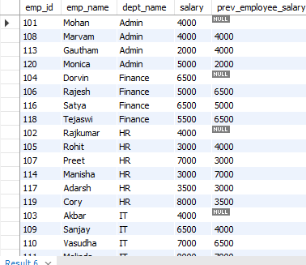
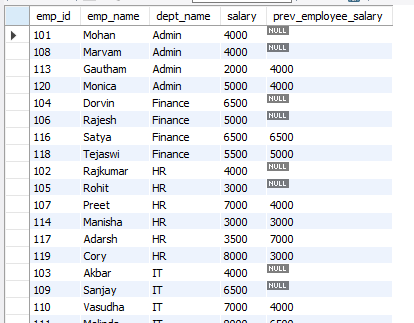

The LAG() function is the opposite of the LEAD() function. While we use LEAD() function to access data from a next row, the LAG() function is used to get access to the data from a previous row in a result-set.

The basic syntax is - 

    LAG(expression,offset, default_value) 
    OVER (
        PARTITION BY partition_expression
        ORDER BY order_expresion ASC|DESC
    )

For example, we are asked to display the salary of the employee that joined before the current employee, for each department.

In this case, we can use the LAG() function to access the data from the previous row.

    SELECT 
        *,
        LAG(salary) OVER(PARTITION BY dept_name ORDER BY emp_id) AS prev_employee_salary
    FROM Employee

We will get the following result-set - 

So, as we can see, since the first row does not have any row before it, the column has NULL for the first row.

And just like LEAD(), we can provide an "offset" value which specifies the row that LAG() will fetch data from. By default, it is "1" which means the data will be fetched from previous row. But, if we mention "2", it means the data is fetched from the row before the previous row.

    SELECT 
        *,
        LAG(salary,2) OVER(PARTITION BY dept_name ORDER BY emp_id) AS prev_employee_salary
    FROM Employee

Now, the result-set is - 

And as expected, the first and second row have NULL as the value for the column because for them, there is no row at a distance of "2" to fetch the data.

So, the bottomline is, Use the MySQL LAG() function to access data of the previous row from the current row.